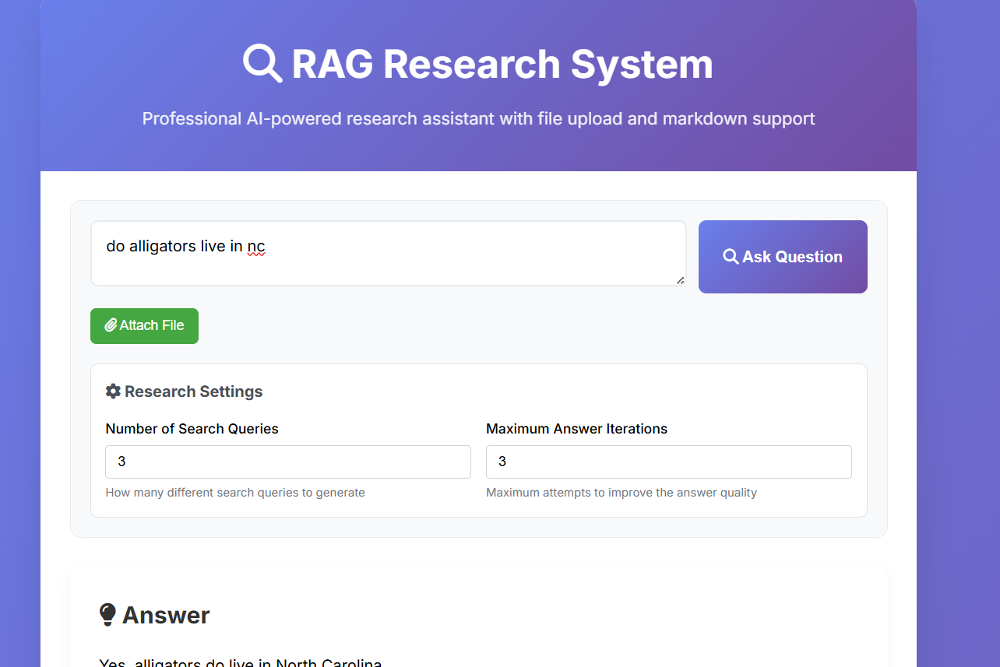

# 🔍 RAG Research System

A modern Retrieval-Augmented Generation (RAG) system that combines web search with AI-powered analysis to provide comprehensive, research-backed answers to your questions.



## ✨ Features

- **🔍 Web Search Integration**: Uses Tavily API for comprehensive web searches
- **🤖 LLM-Powered Analysis**: Compatible with any OpenAI-compatible LLM
- **🌐 Modern Web UI**: Real-time progress tracking with WebSocket updates
- **📊 Structured Research**: Multi-step research pipeline with detailed logging
- **🔧 Modular Architecture**: Clean, maintainable codebase under 300 lines per file
- **📝 Session Logging**: Individual log files for each research session
- **⚡ Fast Package Management**: Uses `uv` for lightning-fast Python package management

## 🚀 Quick Start

### Prerequisites

1. **Install uv** (if not already installed):
   ```bash
   curl -LsSf https://astral.sh/uv/install.sh | sh
   # or: pip install uv
   ```

2. **Get API Keys**:
   - [Tavily API Key](https://tavily.com/) for web search
   - OpenAI API Key or any OpenAI-compatible LLM endpoint

### Installation & Setup

1. **Clone and setup**:
   ```bash
   git clone <repository-url>
   cd sample-rag-supreme-octo-system
   ```

2. **Configure environment**:
   ```bash
   cp .env.example .env
   # Edit .env with your API keys
   ```

3. **Run the application**:
   ```bash
   ./run.sh
   ```

The application will be available at `http://localhost:8000`

## ⚙️ Configuration

Edit the `.env` file with your configuration:

```bash
# Tavily API Configuration
TAVILY_API_KEY=your_tavily_api_key_here

# LLM Configuration (OpenAI-compatible API)
LLM_BASE_URL=https://api.openai.com/v1
LLM_API_KEY=your_openai_api_key_here
LLM_MODEL=gpt-3.5-turbo

# Application Settings
MAX_ITERATIONS=3
LOG_LEVEL=INFO
```

### Alternative LLM Providers

The system works with any OpenAI-compatible API:

```bash
# Local models (e.g., Ollama)
LLM_BASE_URL=http://localhost:11434/v1
LLM_MODEL=llama2

# Other providers
LLM_BASE_URL=https://api.anthropic.com/v1
LLM_MODEL=claude-3-sonnet-20240229
```

## 📁 Project Structure

```
├── src/                    # Source code (all files < 300 lines)
│   ├── models.py          # Pydantic data models (62 lines)
│   ├── llm_client.py      # LLM HTTP client (116 lines)
│   ├── search_client.py   # Tavily search client (77 lines)
│   └── rag_system.py      # Main orchestration (202 lines)
├── templates/
│   └── index.html         # Modern web interface
├── logs/                  # Session log files
├── main.py               # FastAPI application (101 lines)
├── requirements.txt      # Python dependencies
├── run.sh               # Startup script
├── .env.example         # Environment template
├── .gitignore           # Git ignore rules
└── CHANGELOG.md         # Sprint documentation
```

## 🔄 How It Works

1. **Query Generation**: LLM generates multiple specific search queries
2. **Web Search**: Tavily API performs comprehensive web searches
3. **Analysis**: Each search result is analyzed for relevant information
4. **Synthesis**: All research is combined into a comprehensive answer
5. **Real-time Updates**: Progress shown via WebSocket in the UI

## 🛠️ Development

### Manual Setup (Alternative to run.sh)

```bash
# Create virtual environment with uv
uv venv

# Activate environment
source venv/bin/activate

# Install dependencies
uv pip install -r requirements.txt

# Create logs directory
mkdir -p logs

# Run the application
uvicorn main:app --host 0.0.0.0 --port 8000 --reload
```

### Dependencies

- `fastapi` - Modern web framework
- `uvicorn` - ASGI server
- `websockets` - Real-time communication
- `requests` - HTTP client (only HTTP library used)
- `pydantic` - Data validation
- `python-dotenv` - Environment management
- `jinja2` - HTML templating
- `aiofiles` - Async file operations

## 📋 API Usage

### WebSocket Endpoint

Connect to `/ws` for real-time research:

```javascript
const socket = new WebSocket('ws://localhost:8000/ws');

// Send a query
socket.send(JSON.stringify({
    type: 'query',
    content: 'What are the latest developments in AI?'
}));

// Receive progress updates and results
socket.onmessage = function(event) {
    const data = JSON.parse(event.data);
    // Handle: progress, result, or error
};
```

## 🔧 Architecture Principles

- **Modular Design**: Each file has a single responsibility
- **Type Safety**: Pydantic models for all data structures
- **HTTP Only**: Uses only `requests` library for HTTP calls
- **OpenAI Compatible**: Works with any OpenAI-compatible LLM
- **Session Management**: Individual logging per research session
- **Real-time Updates**: WebSocket progress tracking

## 📊 Logging

Each research session creates a detailed log file in the `logs/` directory:

```
logs/
├── session_20250624_143022_123456.log
├── session_20250624_143045_789012.log
└── ...
```

## 🤝 Contributing

1. Ensure all files remain under 300 lines
2. Use only `requests` library for HTTP calls
3. Maintain Pydantic modeling throughout
4. Update `CHANGELOG.md` after each sprint
5. Test with different LLM providers

## 📄 License

This project is a demo application for educational purposes.

---

Built with ❤️ using FastAPI, uv, and modern Python practices.